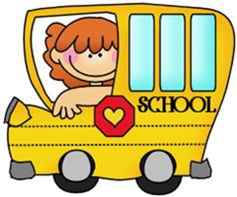

Unit 1

## @color[red](a)

@snap[west]

@color[red](A) girl in @color[red](a) bus.

@snapend

---

## @color[red](in)
@snap[west]

A mouse @color[red](in) a box

@snapend

---

## @color[red](he)
@snap[west]

@color[Red](he) is nice

@snapend

---

## @color[Red](am)
@snap[west]

I @color[red](am) happy

@snapend

---

## @color[red](the)
@snap[west]
@color[red](The) plane is so high.
@snapend

---

## @color[red](big)

@snap[west]

The @color[red](big) man

@snapend

---

## @color[red](will)

@snap[west]
Tomorrow, he @color[red](will) wake up
@snapend

---

## @color[red](said)
@snap[west]
The teacher @color[red](said)  
there is no homework.
@snapend

---

## @color[red](come)

@snap[west]
We @color[red](come) to school everyday
@snapend

---

##  @color[red](mother)
@snap[west]

I love my @color[red](mother)

@snapend

---

##  @color[red](it)
@snap[east]

What is @color[red](it)?

@snapend

---

## @color[red](I)
@snap[west]

@color[red](I) like ice-cream

@snapend
@snap[south-west]
End of unit 1
@snapend

---

Common words for English unit 2

## @color[red](is)

#### The hat @color[red](is) orange

---

## @color[red](go)

#### Let's @color[red](go) to the beach

---

## @color[red](me)

#### He gives @color[red](me) a present

---

## @color[red](car)

#### She is driving in the @color[red](car)

---

## @color[red](and)

#### a boy @color[red](and) a girl

---

## @color[red](dad)

#### My @color[red](dad) is great.

---

## look

#### @color[red](Look)! What is that?

---

## home

#### My family at @color[red](home)

---

## @color[red](like)

#### I @color[red](like) to play basketball

---

## @color[red](get)

#### I @color[red](get) presents

---

## @color[red](have)

#### I @color[red](have) a pencil.

---

## @color[red](can)

#### I @color[red](can) jump

---

## @color[red](do) 

#### Can you touch your toes?
#### Yes, I can @color[red](do) it

---

## @color[red](boy)

#### the @color[red](boy) is happy

---

## @color[red](to) 

#### Let's walk @color[red](to) the shop

---

## You @color[red](see)

#### Can you You @color[red](see) the boat?

---

## @color[red](good)

#### A @color[red](good) students get gems

---

## @color[red](you)

#### I said to @color[red](you), what do @color[red](you) like? 

###### End of unit 2
---

Common words for English  
Unit 3

## no

---

## here

---

## girl

---

## all

---

## up

---

## at

###### End of unit 3

---

Common words for English  
Unit 4

## that
---

## one

---

## this

---

## she
 
---

## of

---

## was

---

## we

---

## jump

---

## are

---

## play 

---

## down

---

## my

###### end of unit 4

---
Common words for English  
Unit 5

## live

---

## thing

---

## when

---

## new

---

## did

---

## name

---

## yes

---

## run

---
## with

---
## don't 
### (do not)

---

## what

---

## little 

###### End of unit 5
---

Common words for English  
Unit 6 

## take
---

## put

---

## him 

---

## on 

---

## some

---

## his
---
## went

---

## into

---

## not
---

## has
--- 

## two

---

## know

###### end of unit 6
---
